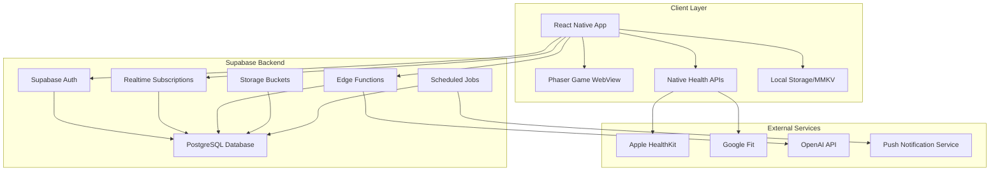

# 16BitFit Technical Design Document

## Executive Summary

16BitFit is a gamified fitness tracking mobile application that combines retro 8-bit aesthetics with modern health monitoring. This document outlines the complete technical architecture for building a scalable, real-time fitness game.

## Technology Stack Justification

### Backend: Supabase (Recommended)
**Why Supabase is perfect for 16BitFit:**
- **Real-time subscriptions**: Live character updates when syncing from Apple Health
- **Row Level Security (RLS)**: Built-in user data isolation
- **Storage**: For future AI photo uploads of meals
- **Edge Functions**: Serverless compute for game logic
- **Authentication**: Social logins + magic links built-in
- **PostGIS**: Location features for future gym check-ins
- **Cost**: Generous free tier perfect for MVP

**Alternative considered**: Firebase (good but more expensive at scale)

### Frontend Stack
```
├── Mobile Shell: React Native + Expo
├── Game Engine: Phaser 3 (wrapped in WebView)
├── State Management: Zustand + React Query
├── Styling: NES.css + Tailwind CSS
├── Health Integration: React Native Health (HealthKit/Google Fit)
├── Push Notifications: Expo Notifications
└── Analytics: Posthog
```

## System Architecture



## Database Schema

### Users Table
```sql
CREATE TABLE users (
  id UUID PRIMARY KEY DEFAULT uuid_generate_v4(),
  email TEXT UNIQUE NOT NULL,
  username TEXT UNIQUE,
  created_at TIMESTAMP WITH TIME ZONE DEFAULT NOW(),
  updated_at TIMESTAMP WITH TIME ZONE DEFAULT NOW(),
  onboarding_completed BOOLEAN DEFAULT FALSE,
  timezone TEXT DEFAULT 'UTC',
  notification_settings JSONB DEFAULT '{
    "daily_reminder": true,
    "achievement_alerts": true,
    "boss_available": true,
    "reminder_time": "09:00"
  }'::jsonb
);

-- Row Level Security
ALTER TABLE users ENABLE ROW LEVEL SECURITY;

CREATE POLICY "Users can only see own data" ON users
  FOR ALL USING (auth.uid() = id);
```

### Characters Table
```sql
CREATE TABLE characters (
  id UUID PRIMARY KEY DEFAULT uuid_generate_v4(),
  user_id UUID REFERENCES users(id) ON DELETE CASCADE,
  name TEXT NOT NULL DEFAULT 'PLAYER ONE',
  avatar_type TEXT DEFAULT 'default', -- For future customization
  
  -- Core Stats (0-100)
  health INTEGER DEFAULT 75 CHECK (health >= 0 AND health <= 100),
  strength INTEGER DEFAULT 50 CHECK (strength >= 0 AND strength <= 100),
  stamina INTEGER DEFAULT 50 CHECK (stamina >= 0 AND stamina <= 100),
  happiness INTEGER DEFAULT 75 CHECK (happiness >= 0 AND happiness <= 100),
  weight INTEGER DEFAULT 50 CHECK (weight >= 0 AND weight <= 100),
  
  -- Derived Stats
  level INTEGER DEFAULT 1,
  experience INTEGER DEFAULT 0,
  power_level INTEGER GENERATED ALWAYS AS (
    FLOOR((strength * 0.4) + (stamina * 0.3) + (health * 0.2) + (happiness * 0.1))
  ) STORED,
  
  -- Character State
  current_state TEXT DEFAULT 'idle_healthy',
  evolution_stage TEXT DEFAULT 'beginner', -- beginner, intermediate, advanced, master
  
  -- Timestamps
  created_at TIMESTAMP WITH TIME ZONE DEFAULT NOW(),
  updated_at TIMESTAMP WITH TIME ZONE DEFAULT NOW(),
  last_fed_at TIMESTAMP WITH TIME ZONE,
  last_workout_at TIMESTAMP WITH TIME ZONE,
  last_decay_at TIMESTAMP WITH TIME ZONE DEFAULT NOW()
);

-- Indexes for performance
CREATE INDEX idx_characters_user_id ON characters(user_id);
CREATE INDEX idx_characters_power_level ON characters(power_level);
```

### Actions Log Table
```sql
CREATE TABLE action_logs (
  id UUID PRIMARY KEY DEFAULT uuid_generate_v4(),
  character_id UUID REFERENCES characters(id) ON DELETE CASCADE,
  action_type TEXT NOT NULL, -- 'food', 'workout', 'skip'
  action_name TEXT NOT NULL, -- 'salad', 'burger', 'run', etc.
  
  -- Stat changes
  health_change INTEGER DEFAULT 0,
  strength_change INTEGER DEFAULT 0,
  stamina_change INTEGER DEFAULT 0,
  happiness_change INTEGER DEFAULT 0,
  weight_change INTEGER DEFAULT 0,
  
  -- Metadata
  source TEXT DEFAULT 'manual', -- 'manual', 'healthkit', 'googlefit'
  raw_data JSONB, -- Store original health data
  
  created_at TIMESTAMP WITH TIME ZONE DEFAULT NOW()
);

-- Index for querying recent actions
CREATE INDEX idx_action_logs_character_created ON action_logs(character_id, created_at DESC);
```

### Boss Battles Table
```sql
CREATE TABLE boss_battles (
  id UUID PRIMARY KEY DEFAULT uuid_generate_v4(),
  character_id UUID REFERENCES characters(id) ON DELETE CASCADE,
  boss_type TEXT NOT NULL, -- 'training_dummy', 'gym_bully', 'fitness_guru', etc.
  boss_power_level INTEGER NOT NULL,
  
  -- Battle Results
  player_power_level INTEGER NOT NULL,
  result TEXT NOT NULL, -- 'victory', 'defeat'
  damage_dealt INTEGER,
  damage_taken INTEGER,
  rewards JSONB, -- {"exp": 100, "achievement": "first_victory"}
  
  battle_duration INTEGER, -- seconds
  created_at TIMESTAMP WITH TIME ZONE DEFAULT NOW()
);
```

### Daily Streaks Table
```sql
CREATE TABLE daily_streaks (
  id UUID PRIMARY KEY DEFAULT uuid_generate_v4(),
  character_id UUID REFERENCES characters(id) ON DELETE CASCADE,
  streak_date DATE NOT NULL,
  
  -- Daily Goals
  workouts_completed INTEGER DEFAULT 0,
  healthy_meals INTEGER DEFAULT 0,
  unhealthy_meals INTEGER DEFAULT 0,
  total_actions INTEGER DEFAULT 0,
  
  -- Achievements
  daily_goal_met BOOLEAN DEFAULT FALSE,
  
  UNIQUE(character_id, streak_date)
);
```

### Achievements Table
```sql
CREATE TABLE achievements (
  id UUID PRIMARY KEY DEFAULT uuid_generate_v4(),
  character_id UUID REFERENCES characters(id) ON DELETE CASCADE,
  achievement_type TEXT NOT NULL,
  unlocked_at TIMESTAMP WITH TIME ZONE DEFAULT NOW(),
  
  UNIQUE(character_id, achievement_type)
);
```

## API Specification

### Authentication Endpoints

```typescript
// Supabase Auth (Built-in)
POST   /auth/signup          // Email/password signup
POST   /auth/signin          // Email/password signin
POST   /auth/signout         // Sign out
POST   /auth/otp            // Magic link login
GET    /auth/user           // Get current user
```

### Character Management

```typescript
// Get character status
GET /api/character
Response: {
  character: {
    id: string,
    name: string,
    stats: {
      health: number,
      strength: number,
      stamina: number,
      happiness: number,
      weight: number
    },
    level: number,
    experience: number,
    powerLevel: number,
    currentState: string,
    evolutionStage: string
  }
}

// Update character name
PATCH /api/character
Body: { name: string }

// Get character with recent actions
GET /api/character/detailed
Response: {
  character: {...},
  recentActions: Action[],
  todayStreak: DailyStreak,
  achievements: Achievement[]
}
```

### Action Logging

```typescript
// Log a food action
POST /api/actions/food
Body: {
  foodType: 'salad' | 'protein' | 'water' | 'burger' | 'soda',
  source: 'manual' | 'healthkit' | 'photo_ai'
}

// Log a workout action
POST /api/actions/workout
Body: {
  workoutType: 'run' | 'lift' | 'stretch',
  duration?: number, // minutes
  source: 'manual' | 'healthkit'
}

// Log skip day
POST /api/actions/skip

// Batch sync from HealthKit
POST /api/actions/sync
Body: {
  actions: [{
    type: 'workout' | 'food',
    name: string,
    timestamp: string,
    healthKitData: object
  }]
}
```

### Boss Battles

```typescript
// Get available bosses
GET /api/bosses
Response: {
  availableBosses: [{
    type: string,
    name: string,
    powerLevel: number,
    requiredPowerLevel: number,
    rewards: object
  }]
}

// Start battle
POST /api/battle
Body: { bossType: string }
Response: {
  battleId: string,
  result: 'victory' | 'defeat',
  damageDealt: number,
  damageTaken: number,
  rewards?: {
    experience: number,
    achievements?: string[]
  }
}
```

### Statistics & Progress

```typescript
// Get user statistics
GET /api/stats
Response: {
  totalWorkouts: number,
  totalHealthyMeals: number,
  currentStreak: number,
  longestStreak: number,
  battlesWon: number,
  achievements: Achievement[]
}

// Get progress chart data
GET /api/progress?days=30
Response: {
  dates: string[],
  health: number[],
  strength: number[],
  stamina: number[],
  weight: number[]
}
```

## Supabase Edge Functions

### Daily Decay Function
```typescript
// supabase/functions/daily-decay/index.ts
import { serve } from 'https://deno.land/std@0.168.0/http/server.ts'
import { createClient } from '@supabase/supabase-js'

serve(async (req) => {
  const supabase = createClient(
    Deno.env.get('SUPABASE_URL')!,
    Deno.env.get('SUPABASE_SERVICE_ROLE_KEY')!
  )

  // Apply daily decay to all characters
  const { data: characters } = await supabase
    .from('characters')
    .select('*')
    .gt('last_decay_at', new Date(Date.now() - 24 * 60 * 60 * 1000))

  for (const character of characters) {
    await supabase.from('characters').update({
      health: Math.max(0, character.health - 1),
      strength: Math.max(0, character.strength - 1),
      stamina: Math.max(0, character.stamina - 2),
      weight: Math.min(100, character.weight + 1),
      happiness: Math.max(0, character.happiness - 2),
      last_decay_at: new Date()
    }).eq('id', character.id)
  }

  return new Response(JSON.stringify({ decayed: characters.length }))
})
```

### Process Photo Function (AI Integration)
```typescript
// supabase/functions/process-meal-photo/index.ts
import { serve } from 'https://deno.land/std@0.168.0/http/server.ts'
import OpenAI from 'openai'

serve(async (req) => {
  const { photoUrl } = await req.json()
  
  const openai = new OpenAI({
    apiKey: Deno.env.get('OPENAI_API_KEY')
  })

  const response = await openai.chat.completions.create({
    model: "gpt-4-vision-preview",
    messages: [{
      role: "user",
      content: [
        { type: "text", text: "Analyze this meal and categorize as healthy or unhealthy. Return JSON with: {type: 'healthy'|'unhealthy', confidence: 0-100, nutrients: {calories: number, protein: number, carbs: number, fat: number}}" },
        { type: "image_url", image_url: { url: photoUrl } }
      ]
    }]
  })

  return new Response(response.choices[0].message.content)
})
```

## Real-time Subscriptions

```typescript
// Character stats subscription
const characterSubscription = supabase
  .channel('character-updates')
  .on(
    'postgres_changes',
    {
      event: 'UPDATE',
      schema: 'public',
      table: 'characters',
      filter: `user_id=eq.${userId}`
    },
    (payload) => {
      updateLocalCharacterState(payload.new)
    }
  )
  .subscribe()

// Battle notifications
const battleChannel = supabase
  .channel('battle-room')
  .on('broadcast', { event: 'battle-update' }, (payload) => {
    updateBattleAnimation(payload)
  })
  .subscribe()
```

## Security & Performance

### Row Level Security Policies
```sql
-- Characters: Users can only access their own
CREATE POLICY "Users can CRUD own characters" ON characters
  FOR ALL USING (auth.uid() = user_id);

-- Action logs: Users can only see their character's actions
CREATE POLICY "Users can view own action logs" ON action_logs
  FOR SELECT USING (
    character_id IN (
      SELECT id FROM characters WHERE user_id = auth.uid()
    )
  );

-- Boss battles: Users can only see their own battles
CREATE POLICY "Users can view own battles" ON boss_battles
  FOR SELECT USING (
    character_id IN (
      SELECT id FROM characters WHERE user_id = auth.uid()
    )
  );
```

### Performance Optimizations

1. **Database Indexes**
   - User lookup: `idx_users_email`
   - Character queries: `idx_characters_user_id`
   - Action history: `idx_action_logs_character_created`
   - Leaderboards: `idx_characters_power_level`

2. **Caching Strategy**
   - Character stats: 5-minute cache in Zustand
   - Achievements: 1-hour cache
   - Leaderboards: 15-minute cache

3. **Data Sync Strategy**
   - HealthKit sync: Every 30 minutes or on app foreground
   - Character decay: Once per day via cron job
   - Real-time updates: Only for active battles

## Mobile-Specific Considerations

### React Native Architecture
```
src/
├── components/
│   ├── GameWebView.tsx      // Phaser wrapper
│   ├── HealthKitSync.tsx    // Health data integration
│   └── PushHandler.tsx      // Notification manager
├── screens/
│   ├── HomeScreen.tsx       // Character + actions
│   ├── StatsScreen.tsx      // Progress tracking
│   └── BattleScreen.tsx     // Boss fights
├── services/
│   ├── supabase.ts          // Supabase client
│   ├── health.ts            // HealthKit/Google Fit
│   └── storage.ts           // MMKV for offline
└── store/
    ├── characterStore.ts    // Zustand store
    └── gameStore.ts         // Game state
```

### Offline Support
```typescript
// MMKV for offline action queue
import MMKVStorage from 'react-native-mmkv-storage'

const storage = new MMKVStorage.Loader().initialize()

// Queue actions when offline
const queueAction = async (action: GameAction) => {
  const queue = await storage.getArray('actionQueue') || []
  queue.push({ ...action, timestamp: new Date() })
  await storage.setArray('actionQueue', queue)
}

// Sync when back online
const syncOfflineActions = async () => {
  const queue = await storage.getArray('actionQueue') || []
  for (const action of queue) {
    await supabase.from('action_logs').insert(action)
  }
  await storage.setArray('actionQueue', [])
}
```

## Deployment Strategy

### Environment Variables
```env
# Supabase
EXPO_PUBLIC_SUPABASE_URL=https://xxx.supabase.co
EXPO_PUBLIC_SUPABASE_ANON_KEY=xxx

# Services
OPENAI_API_KEY=sk-xxx
POSTHOG_API_KEY=xxx

# App Config
EXPO_PUBLIC_ENVIRONMENT=production
EXPO_PUBLIC_API_VERSION=v1
```

### Build Configuration
```json
// app.json
{
  "expo": {
    "name": "16BitFit",
    "slug": "sixteenbitfit",
    "version": "1.0.0",
    "platforms": ["ios", "android"],
    "ios": {
      "bundleIdentifier": "com.yourcompany.sixteenbitfit",
      "buildNumber": "1",
      "infoPlist": {
        "NSHealthShareUsageDescription": "16BitFit needs access to your workout data to track your character's progress",
        "NSHealthUpdateUsageDescription": "16BitFit will log your workouts to help your character grow stronger"
      }
    },
    "android": {
      "package": "com.yourcompany.sixteenbitfit",
      "versionCode": 1,
      "permissions": ["android.permission.ACTIVITY_RECOGNITION"]
    }
  }
}
```

## Testing Strategy

### Unit Tests
```typescript
// Character stat calculations
describe('Character Stats', () => {
  test('power level calculation', () => {
    const stats = { health: 80, strength: 60, stamina: 70, happiness: 50 }
    expect(calculatePowerLevel(stats)).toBe(66) // (60*.4)+(70*.3)+(80*.2)+(50*.1)
  })
})
```

### Integration Tests
```typescript
// Supabase operations
describe('Character API', () => {
  test('create and update character', async () => {
    const { data: character } = await supabase
      .from('characters')
      .insert({ user_id: testUserId })
      .select()
      .single()
    
    expect(character.health).toBe(75)
    
    await applyAction(character.id, 'food', 'salad')
    
    const { data: updated } = await supabase
      .from('characters')
      .select()
      .eq('id', character.id)
      .single()
    
    expect(updated.health).toBe(80)
  })
})
```

## Monitoring & Analytics

### Key Metrics to Track
```typescript
// Posthog events
track('action_completed', {
  action_type: 'workout',
  action_name: 'run',
  character_level: 3,
  power_level: 45
})

track('boss_battle', {
  boss_type: 'training_dummy',
  result: 'victory',
  player_power: 35,
  boss_power: 30
})

track('daily_streak', {
  streak_length: 7,
  actions_today: 5
})
```

### Error Tracking
```typescript
// Sentry integration
Sentry.init({
  dsn: process.env.SENTRY_DSN,
  environment: process.env.ENVIRONMENT,
  beforeSend(event) {
    // Sanitize user data
    delete event.user?.email
    return event
  }
})
```

## Future Scalability

### Phase 2 Features (Technical Prep)
1. **Multiplayer Battles**
   - WebSocket connections via Supabase Realtime
   - Matchmaking queue in Redis
   - ELO rating system

2. **AI Meal Analysis**
   - Image upload to Supabase Storage
   - Edge function for OpenAI Vision API
   - Nutrition database integration

3. **Social Features**
   - Friend system with junction table
   - Activity feed with pagination
   - Guild/team mechanics

### Database Migrations
```sql
-- Future: Social features
CREATE TABLE friendships (
  id UUID PRIMARY KEY DEFAULT uuid_generate_v4(),
  user_id UUID REFERENCES users(id),
  friend_id UUID REFERENCES users(id),
  status TEXT DEFAULT 'pending', -- pending, accepted, blocked
  created_at TIMESTAMP WITH TIME ZONE DEFAULT NOW(),
  
  UNIQUE(user_id, friend_id)
);

-- Future: Guild system
CREATE TABLE guilds (
  id UUID PRIMARY KEY DEFAULT uuid_generate_v4(),
  name TEXT UNIQUE NOT NULL,
  description TEXT,
  leader_id UUID REFERENCES users(id),
  member_count INTEGER DEFAULT 1,
  total_power_level INTEGER DEFAULT 0,
  created_at TIMESTAMP WITH TIME ZONE DEFAULT NOW()
);
```

## Conclusion

This technical design provides a complete blueprint for building 16BitFit with modern, scalable architecture. The combination of React Native, Phaser, and Supabase creates a powerful stack that can grow from MVP to full-featured fitness gaming platform.